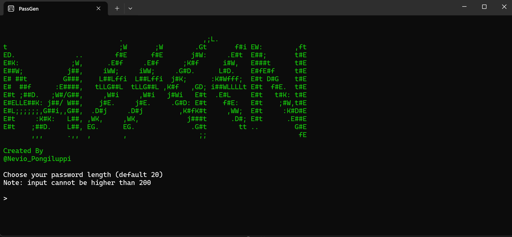
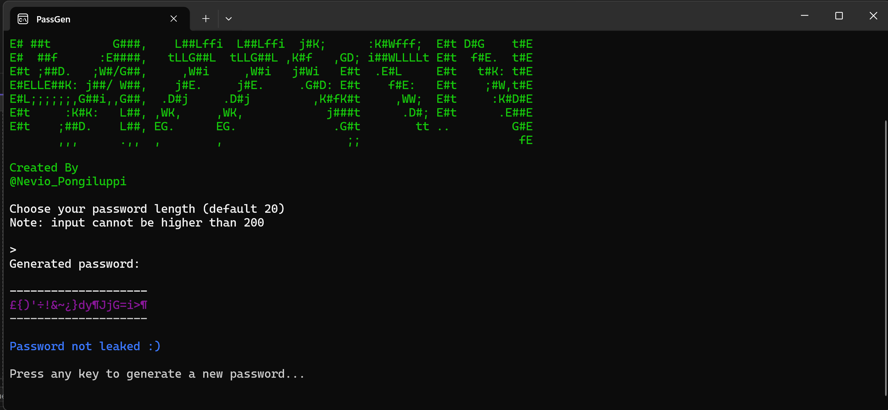
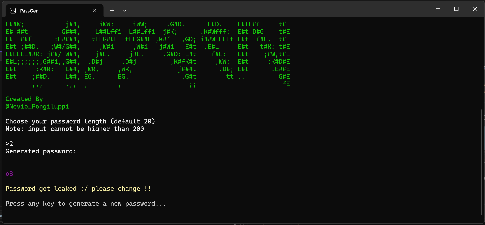
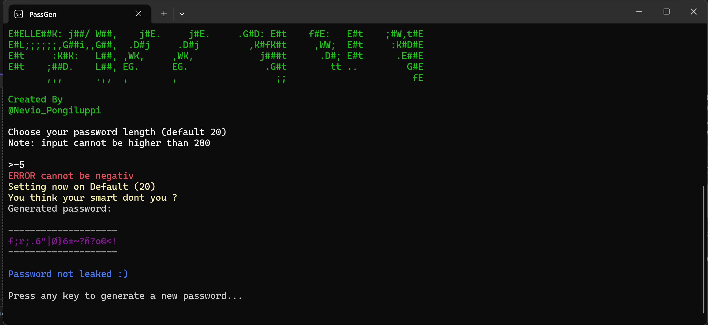
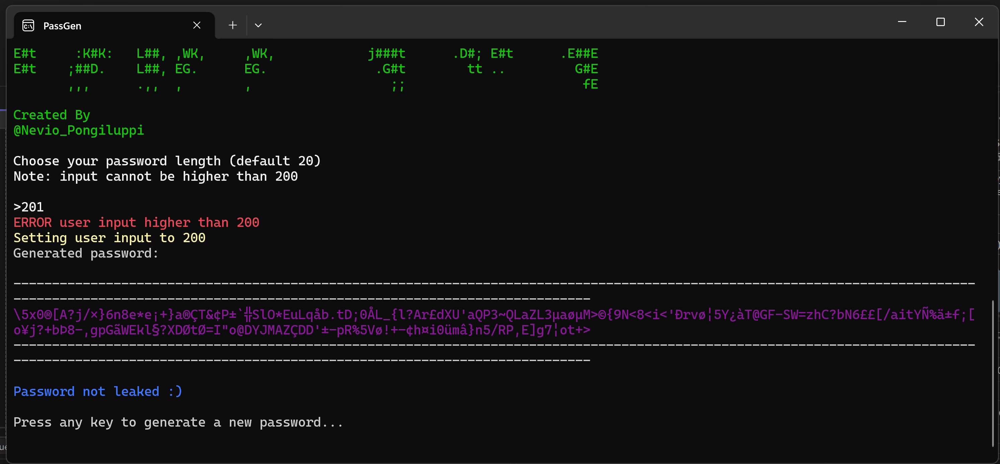

# PassGen 🔐

```
                             .                    ,;L.            
t                            ;W       ;W        .Gt       f#i EW:        ,ft
ED.               ..        f#E      f#E       j#W:     .E#t  E##;       t#E
E#K:             ;W,      .E#f     .E#f      ;K#f      i#W,   E###t      t#E
E##W;           j##,     iWW;     iWW;     .G#D.      L#D.    E#fE#f     t#E
E# ##t         G###,    L##Lffi  L##Lffi  j#K;      :K#Wfff;  E#t D#G    t#E
E#  ##f      :E####,   tLLG##L  tLLG##L ,K#f   ,GD; i##WLLLLt E#t  f#E.  t#E
E#t ;##D.   ;W#/G##,     ,W#i     ,W#i   j#Wi   E#t  .E#L     E#t   t#K: t#E
E#ELLE##K: j##/ W##,    j#E.     j#E.     .G#D: E#t    f#E:   E#t    ;#W,t#E
E#L;;;;;;,G##i,,G##,  .D#j     .D#j         ,K#fK#t     ,WW;  E#t     :K#D#E
E#t     :K#K:   L##, ,WK,     ,WK,            j###t      .D#; E#t      .E##E
E#t    ;##D.    L##, EG.      EG.              .G#t        tt ..         G#E
       ,,,      .,,  ,        ,                  ;;                       fE

```
**Created By:**
@Nevio_Pongiluppi

---

## Inhalt

1. [Idee / Nutzen](#idee--nutzen)  
2. [Programmbeschreibung und Ablauf](#programmbeschreibung-und-ablauf)  
3. [Screenshots](#screenshots)  
4. [Installation & Ausführen](#installation--ausführen)  
5. [Reflexion](#reflexion)  
6. [Code Review Mio Galli 10.01.2026](#code-review-mio-galli-10012026)  
7. [Funktionalität](#funktionalität)  
8. [Verständlichkeit](#verständlichkeit)  
9. [Stärken](#stärken)  
10. [Fazit](#fazit)  

---

## Idee / Nutzen

Die Idee für **PassGen** entstand, als mir bewusst wurde, dass ich selbst Passwort-Generatoren nutze, ohne wirklich zu wissen, was dahinter passiert. Das ließ mich unwohl fühlen, also entschloss ich mich, einen eigenen zu bauen, dem ich vertrauen kann.

**PassGen** ist ein CLI-Tool zum Erstellen von **nicht vorhersehbaren und nicht geleakten Passwörtern**.

- Passwortlänge: 0–200 Zeichen  
- Nach der Erstellung wird mit Hilfe von **HIBP (Have I Been Pwned)** überprüft, ob das Passwort bereits in einem Datenleck gefunden wurde.

---

## Programmbeschreibung und Ablauf

### Start und Initialisierung

- Konsolentitel wird gesetzt  
- Großes Zeichenalphabet wird definiert:  
  - Groß- und Kleinbuchstaben  
  - Zahlen  
  - Sonderzeichen  
  - Unicode-Symbole  
  - Umlaute  
- Dadurch hohe Entropie und Sicherheit der generierten Passwörter

### Banner Ausgabe

- ASCII-Banner zu Beginn jedes Durchlaufs  
- Reine optische Darstellung, ohne Einfluss auf die Programmlogik

### Benutzereingabe der Passwortlänge

- Benutzer wird aufgefordert, Passwortlänge einzugeben  
- Standardwert: 20 Zeichen, wenn Eingabe ungültig oder leer  
- Negative Werte → Standardwert  
- Werte >200 → auf 200 begrenzt  
- Easter Egg möglich (keine schädliche Überraschung, bleibt geheim)

### Erzeugung der Zufallsbasis

- SHA-256 Hash wird erzeugt aus:  
  1. Externer API (Webcam-Input, live, selbst gehostet)  
  2. Lokale kryptographisch sichere Zufallsdaten  
- Kombination der beiden Hashes via **HMAC SHA-256**  
- Fallback: rein lokale Zufallsdaten, falls API nicht erreichbar

### Aufbau des Passworts

- Hash → Byte-Array  
- Modulo-Operation auf Alphabet → Passwortzeichen  
- Gleichmäßig verteiltes, zufälliges Passwort

### Ausgabe des Passworts

- Passwort wird in Konsole farblich hervorgehoben

### Überprüfung auf Datenlecks

- SHA-1 Hash → HIBP API (K-Anonymity)  
- Benutzer wird gewarnt, falls Passwort geleakt  
- Positive Rückmeldung, wenn Passwort sicher

### Wiederholung des Programms

- Nach Tastendruck: neuer Ablauf, neues Passwort kann generiert werden

---

## Screenshots

**Programm bei Start:**  


**Wenn Enter ohne Eingabe gedrückt:**  


**Länge 2 gewählt, Passwort in Datenbank gefunden:**  


**Minuszahl eingegeben:**  


**Über 200 eingegeben:**  


*(Screenshots bitte durch tatsächliche Bilder ersetzen)*

---

## Installation & Ausführen

Um **PassGen** auf Ihrem System auszuführen, wählen Sie die passende Version:

### Windows

1. Laden Sie die Datei `PassGen.exe` aus dem Release-Bereich herunter.  
2. Doppelklicken Sie auf `PassGen.exe`, um das Programm zu starten.  
3. Folgen Sie den Anweisungen in der Konsole, um die Passwortlänge einzugeben und Passwörter zu generieren.

> Hinweis: Wenn Sie die HIBP-API nutzen möchten, benötigen Sie eine Internetverbindung.

---

### Linux (Binary)

1. Laden Sie die Datei `PassGen` (ohne Dateiendung) aus dem Release-Bereich herunter.  
2. Machen Sie das Binary ausführbar:

```bash
chmod +x PassGen
./PassGen
```

